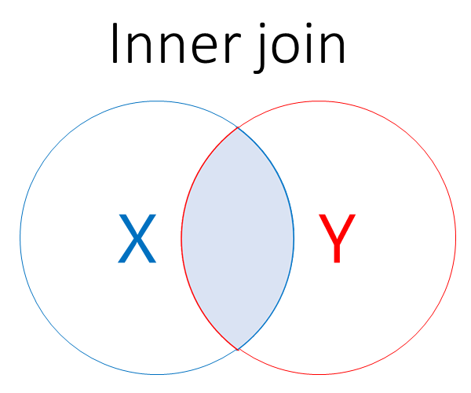
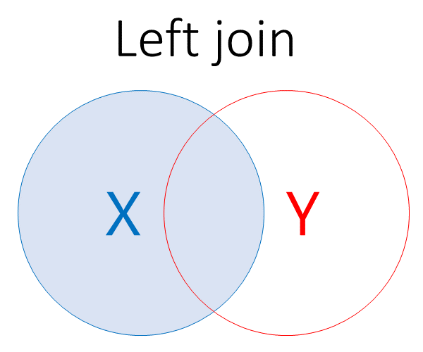
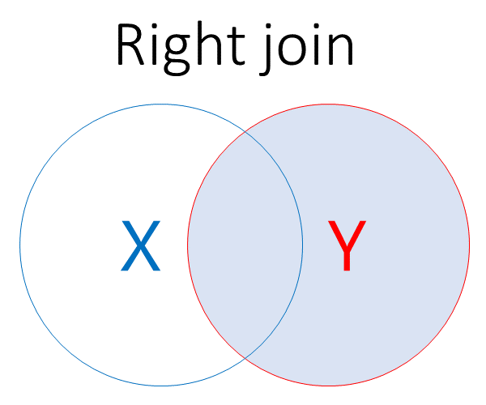
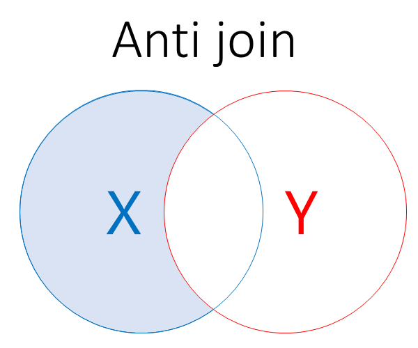

# Getting the best out of dplyr {.tabset}

```{r setup, include=FALSE}
knitr::opts_chunk$set(echo = TRUE, warning = F, message = F, results = 'asis')
install.packages(setdiff("pacman", rownames(installed.packages())))
library("pacman")
p_load(tidyr,readr,DiagrammeR,ggplot2,dplyr,lubridate,NHSRplotthedots,readxl,stringr,NHSRdatasets, purrr, rlang, glue)

# avoiding tidyverse due to memory issues in RStudio Cloud environment 

# function to add new window links
link<-function(text,url) {
  target<-c('{target="_blank"}')
  glue('[{text}]({url}){target}')
}
```

The aim of this session is to do three things with dplyr:

+ build your fluency with basic dplyr functionality
+ show some of the similarities of approach across the package, again to help you master the syntax
+ learn some of the more advanced functions to harness the power available beneath the surface

This training session is part of a wider training programme designed as next steps for R users who have moved beyond introductory training. This programme covers:

+ tidy evaluation
+ functions
+ dplyr
+ purr

This dplyr training can be taken as a stand-alone session, or integrated into a more involved programme with the other sessions. You can find further details on the `r link("TURAS page", "https://learn.nes.nhs.scot/64644")`, join the `r link("KIND Learning Network", "https://forms.office.com/r/WQdd6HSCEW")` for social learning support, or contact [Brendan Clarke](mailto: brendan.clarke2@nhs.scot?subject=Intermediate R training) with any queries, comments, or suggestions. You can also find the source code for this training on the `r link("GitHub repository", "https://github.com/bclarke-nes/Intermediate-R")`.

## Introduction

In this session, we will cover the following areas:  

1. An introduction to the NHS-R data sets, which are used throughout the rest of this training
2. Investigating data, where look at some dplyr functions that are particularly helpful when looking at a new data set
3. A brief introduction to tidyselect, where we'll learn some new ways of referencing columns in dplyr. We'll also use this section as a refresher on core dplyr functions
4. A section on summarising data
5. Joins

You should have at least some previous experience working with dplyr before starting this training. Specifically, you should be familiar with at least:

+ `select()`, to select columns from data
+ `filter()`, to select rows from data
+ `mutate()`, to make new columns from existing columns

You should also have some basic experience of using R to manage data. This training covers lots of different aspects of managing data quite quickly. If this is a completely new topic for you, you might find the [introductory R training](https://learn.nes.nhs.scot/62249){target="_blank"} that we offer more helpful.

Before we start, [Rstudio's dplyr cheatsheet](https://raw.githubusercontent.com/rstudio/cheatsheets/main/data-transformation.pdf){target="_blank"} is helpful to have at hand for quick reference and comparison of functions.

## NHS-R data {.tabset}

Because dplyr provides tools for working with data, we'll need some suitable data to play with. R comes with lots of interesting data sets built-in, which you can explore using `data()`. To try and stick to the health and social care theme of this training though we'll use some health datasets put together by the `r link("NHS-R community", "https://nhsrcommunity.com/")`. You can find additional explanatory materials for these NHS data sets on `r link("CRAN", "https://cran.r-project.org/web/packages/NHSRdatasets/index.html")`, but the short version is that the `NHSRdatasets` package contains five datasets:

+ `ae_attendances` - A+E attendance data
+ `LOS_model` - length of stay data
+ `ons_mortality` - England and Wales mortality data
+ `stranded_data` - synthetic data, designed for training machine learning models
+ `synthetic_news_data` - synthetic data about early warning scores, again designed for ML purposes

Let's look at these datasets below. If you're following the code, you'll see that there are a couple of helper functions to simplify some of the display work here. We'll start to use these datasets in the next section:

```{r echo=F}

# functions to stream-line displaying our data

data_describer <- function(df) {

  # allows us to display the name of the df as a new subsection with a little bit of nicely formatted Rmarkdown  
  df_name <- deparse(substitute(df))
  
  cat(glue("  \n### {df_name}  \n  \n"))
  cat(glue("  \n`{df_name}` has {nrow(df)} rows and {length(df)} columns.  \n  \n"))
  display(df)

}

# function to save typing head() and kable() hundreds of times
display <- function(df) {
  df %>%
    head() %>%
    knitr::kable()
}

## 5 data sets

#- tidy data from A+E attendances
data_describer(ae_attendances)

#- tidy length of stay data
data_describer(LOS_model)

#- eng Wales mortality data
data_describer(ons_mortality)

#- synthetic data for ML models
data_describer(stranded_data)

#- synthetic early warning score data
data_describer(synthetic_news_data)
```

## Investigating data {.tabset}

Before we start learning some new dplyr functions, we should point out a feature of the data in the five `NHSRdatasets` package. This data is `r link("tidy", "https://cran.r-project.org/web/packages/tidyr/vignettes/tidy-data.html")`. By this, we mean that:

+ Every column is a variable.
+ Every row is an observation.
+ Every cell is a single value.

Tidying data is an art of its own. For this training session, though, you can assume that the data that we'll be working with starts off in this tidy format, and we won't need to do any of this work ourselves. 
We'll start with four functions that are especially useful when you're investigating new data - `slice()`, `glimpse()`, `rename()` and `relocate()`:

### `slice()`

+ `r link("slice() manual page", "https://dplyr.tidyverse.org/reference/slice.html")`

At its simplest, `slice()` is an alternative to head:
```{r echo=T}
ae_attendances %>% 
  slice(1:6) %>%
  knitr::kable()

```

The number supplied to `slice()` returns that row - so `slice(3)` shows the third row. You can also provide a sequence or vector of rows:

```{r echo=T}
ae_attendances %>% 
  slice(1:3) %>%
  knitr::kable()

ae_attendances %>% 
  slice(2,5,918) %>%
  knitr::kable()
```

More interestingly, you can `group_by()`, then slice, to see the first row of each group. Here, the data is filtered, grouped by org_code, then we slice the top row of each group:

```{r}
ae_attendances %>%
  filter(attendances >= 20000) %>%
  group_by(org_code) %>%
  slice(n=1) %>%
  knitr::kable()
```

(we'll explore `group_by()` later in the session, so don't worry if this is new to you)

The `slice_min()` and `slice_max()` functions are also useful, giving you something like an integrated `arrange()` for looking at slices of the data:

```{r}
ae_attendances %>%
  slice_max(breaches, n=6) %>%
  knitr::kable()

# equivalent to

ae_attendances %>%
  arrange(desc(breaches)) %>%
  slice(1:6) %>%
  knitr::kable()
```

While `slice_sample()` gives a random sampling of the data.
```{r}
ae_attendances %>%
  slice_sample(n=6) %>%
  knitr::kable()
```

There are also `slice_head()` and `slice_tail()` functions which work in the same way.

Final tip - slice with a negative index can be used as like `filter()` to remove the specified row(s):
```{r}
# returns the last 5 rows only
ae_attendances %>% 
  slice(-1:-12760) %>%
  knitr::kable()
```

#### Exercise

Use `slice` on the ons_mortality data to:

Show the 9th row:
```{r}
# write your code here
```

Show the 9th row:
```{r}
# write your code here
```

Select the even-numbered rows:
```{r}
# write your code here

# hint - seq()
```


### `glimpse()`

+ `r link("glimpse() manual page", "https://dplyr.tidyverse.org/reference/glimpse.html")`

`glimpse()` is a data viewing function similar to `print()`, except it transposes the data so that each column is displayed as a row. This is particularly useful for wide data with many columns, especially when you are interested in checking the class (date, character, etc.) of your columns.

```{r eval=T, results='markup'}
# glimpse for names and types.
synthetic_news_data %>% 
  glimpse() 
```

Note the useful dimension information in the first two lines, and the class information in angle brackets. Okay, so there are lots of similar ways of displaying the same information, but `glimpse()` is nice and concise both to write and to read. Compare a couple of base r (or purrr) near-equivalents, which are especially messy when the data is quite wide:

```{r results='markup'}
# finding column classes # map_df
synthetic_news_data %>% map_df(class)

# equivalent in base R
lapply(synthetic_news_data, class)
```

`glimpse()` plays nicely with the pipe, meaning that it's potentially useful while you're working on a complicated data transformation. If you have lots of stages piped together, you can insert `glimpse()` in periodically to check that each stage of your transformation is working as expected:

```{r eval=T, results='markup'}
synthetic_news_data %>% 
  glimpse() %>%
  filter(age == 71 & male == 0) %>%
  glimpse() %>%
  mutate(pulse_pres = syst-dias) %>%
  glimpse()

```


### `rename()` (and `rename_with()`)

+ `r link("rename() manual page", "https://dplyr.tidyverse.org/reference/rename.html")`

`rename()` renames columns. Like `mutate()`, the general syntax for `rename()` is *new name* = *old name*.

```{r}
LOS_model %>%
  rename(age = Age) %>%
  display()
```

There's not much more to say about the basic `rename()` function beyond that. However, the scoped variant, `rename_with()` does provide some useful additional tools. For example, we can use `tolower()` - which converts strings to all lower-case - to rename multiple columns at once:

```{r}
LOS_model %>% 
  rename_with(tolower) %>%
  display()
```
`rename()` works well with tidyselect operators, which we'll cover briefly during this session. 
We also have a stand-alone session on [tidy evaluation](https://dplyr.tidyverse.org/articles/programming.html), which covers this territory in more depth.

#### Exercise

There are lots of useful tools in the stringr package that can be used to change the case of text. However, for this exercise, let's borrow some code from the base-R `tolower()` manual page to create our own `capwords()` function that capitalises words:

```{r results='markup'}
capwords <- function(s, strict = FALSE) {
    cap <- function(s) paste(toupper(substring(s, 1, 1)),
                  {s <- substring(s, 2); if(strict) tolower(s) else s},
                             sep = "", collapse = " " )
    sapply(strsplit(s, split = " "), cap, USE.NAMES = !is.null(names(s)))
}

capwords(c("owl", "towel"))
```

Can you use `capwords()` to convert the synthetic_news_data column headings to title case?

```{r}
# write your code here

```

### `relocate()`

+ `r link("relocate() manual page", "https://dplyr.tidyverse.org/reference/relocate.html")`

`relocate()` re-arranges the order of columns:

```{r}
LOS_model %>%
  display()
```

`relocate()`'s default behaviour is to move specified columns to the far left:
```{r}
LOS_model %>%
  relocate(LOS) %>%
  display()
```

You can specify `.before` and `.after` if you need finer control over where your column ends up:

```{r}
LOS_model %>%
  relocate(LOS, .after=Death) %>%
  display()

LOS_model %>%
  relocate(Death, .before=last_col()) %>%
  display()
```


## tidyselect {.tabset}

Lots of the power in `dplyr` comes from the many ways that you can select columns. In this section, we'll look at some examples of tidyselect, which is a series of functions that allow you to specify columns by various  patterns. Not only does this give you lots of ways of simplifying and streamlining your code, but it's also a great way of making your code more portable - so that it works well inside functions, or across different data sets. 

In the tidyevaluation training session, we look across this material in much more depth. There's quite a lot to absorb, so I would definitely recommend using the manual pages (using `??tidyselect`) as a reference for this section.

### `contains()`

`contains()` is a good example of tidyselect functions that are based on pattern matching. There are several related functions that work in the same way, including:

  + `starts_with()`
  + `ends_with()`
  + `matches()`
  + `num_range()`
  
Here, we'll concentrate on `contains()` as an exemplar for this family, because the other functions in the family work in a very similar way. `contains()` allows you to pick columns based on their names. So to `select()` all the columns in `stranded_data` whose names contain the string "care":

```{r warning=F, message=F}
stranded_data %>%
  select(contains("care")) %>%
  display()
```

Note that by default this string matching is case insensitive, so "care" will match columns called "CARE", "Care", and "cArE". You can also combine the `contains()` statement with other `select()` criteria:

```{r warning=F, message=F}
stranded_data %>%
  select(age, contains("care")) %>%
  display()
```

And you can match over a vector of strings:

```{r warning=F, message=F}
stranded_data %>%
  select(contains(c("care", "age"))) %>%
  display()
```

The order of strings in your vector will determine the order of columns returned:

```{r warning=F, message=F}
stranded_data %>%
  select(contains(c("age", "care"))) %>%
  display()
```

And you can negate the `contains()` to give the complement:

```{r warning=F, message=F}
stranded_data %>%
  select(-contains(c("age", "care"))) %>%
  display()
```

#### Exercise

Here's a vector of partial names of unwanted columns from the synthetic_news_data set. Can you use `contains()` to remove these columns and display the result?

```{r}
unwanted_names <- substring(names(synthetic_news_data)[seq(1, 11, 2)], 1, 2)

# write your code here.

```


### `any_of()`

`any_of()` matches **full** column names from a vector of names. Let's set up some names:

```{r results='markup'} 
my_columns <- names(stranded_data)[1:4]
my_columns
```

If we supply `any_of()` with this vector of names, `any_of()` will match any column names that appear in the vector, and ignore those that do not:

```{r}
stranded_data %>%
  select(any_of(my_columns)) %>%
  display()
```

Compared to `contains()`, `any_of()` will match the entire name, while `contains()` will match any part of the name. 

There's a great tip on the `all_of()` man page - `any_of()` is an especially clever way to drop columns from a tibble because calling it more than once does not cause an error:

```{r warning=T, message=F}
stranded_data %>%
  select(-any_of(my_columns)) %>%
  select(-any_of(my_columns)) %>%
  display()
```

Trying to do something similar using `select()` will cause an error:

```{r results='markup'}
try(stranded_data %>%
  select(-age) %>%
  select(-age))
```

### `everything()`

`everything()` selects all columns. This is less useful in combination with `select()` itself, but simplifies some other functions well - particularly with `pivot_longer()`. 

```{r}
stranded_data %>% 
  select(2:5) %>%
  pivot_longer(everything()) %>%
  display()
```

See also `last_col()`, which is another example of a tidyselect helper for specific columns.

## Summarising {.tabset}

This section introduces and explores four dplyr functions. Each of these are important, but their real strength comes from combining them to help summarise data. The functions are:
  
+ `group_by()`, which puts our data into groups
+ `summarise()`, which gives us ways of summarising our data
+ `count()`, which (surprise, surprise) counts our data
+ `tally()`, which counts our data in a slightly different way.

We're also going to talk about `rowwise()`, which is a bit of an oddball function for working along rows, rather than the usual column-based approach that we take almost everywhere else in dplyr. The reason we're going to talk about it here is that it's an important tool for producing aggregates along rows (say, an average of several measures).

### `group_by()` and `summarise()`

Let's start with `group_by()`. `group_by()` is an odd function because, at first glance, it doesn't seem to do anything at all:

```{r}
ae_attendances %>% 
  group_by(period) %>%
  display()

ae_attendances %>% 
  group_by(org_code) %>%
  display()
```

However, if we add in `count()` to this code, we start to see what `group_by()` might be doing:

```{r}
ae_attendances %>% 
  count(breaches) %>%
  display()

ae_attendances %>% 
  group_by(org_code) %>%
  count(breaches) %>% 
  display()
```

In the first case, we've counted up all the rows where breaches = 0, = 1, = 2, and so on. In the second case, this counting has still occurred, but the counts are divided into individual days. This is because we've now grouped the data by period (which contains dates). So `group_by()` doesn't change your data directly. Instead, it changes the description of your data (the meta-data). You can then use this meta-data to change how R treats the data. So let's group by org_code to give an overview of breaches by organisation:

```{r}
ae_attendances %>% 
  group_by(org_code) %>%
  count(breaches) %>%
  arrange(desc(breaches)) %>%
  display()
```
  
we'll deal with `count()` more fully in the next subsection. One last thing to note here though: `ungroup()` removes groupings:

```{r}
ae_attendances %>% 
  group_by(org_code) %>%
  ungroup() %>%
  count(breaches) %>%
  display()
```

For now though, we'll look at `summarise()`.

The description on the `r link("dplyr reference page for summarise", "https://dplyr.tidyverse.org/reference/summarise.html")` is admirably clear:

> summarise() creates a new data frame. It will have one (or more) rows for each combination of grouping variables; if there are no grouping variables, the output will have a single row summarising all observations in the input. It will contain one column for each grouping variable and one column for each of the summary statistics that you have specified.

```{r}
ae_attendances %>% 
  summarise(sum(attendances)) %>%
  display()
```

`summarise()` is especially strong in concert with `group_by()`:

```{r}
ae_attendances %>% 
  group_by(org_code) %>%
  summarise(sum(attendances)) %>%
  display()
```

Two important things to note here:
  
+ `group_by` doesn't change how the data looks - just how it behaves:
+ Each call to `summarise()` removes a layer of grouping

```{r}
ae_attendances %>% 
  group_by(org_code) %>%
  summarise(sum(attendances)) %>%
  summarise(sum(`sum(attendances)`)) %>%
  display()
```

And you can build simple formulae inside `summarise()`:

```{r}
ae_attendances %>% 
  group_by(org_code) %>%
  summarise(total = sum(attendances)) %>%
  arrange(desc(total)) %>%
  display()

ae_attendances %>% 
  group_by(org_code) %>%
  summarise(non_admissions = sum(attendances - admissions)) %>%
  arrange(desc(non_admissions)) %>%
  display()

```


#### Exercise

That's quite a lot of explanation. Let's try some simple group-and-summarise activities at this point.

First, let's take the ons_mortality, which is a bit more complicated than the ae_attendances data we've been using so far. One of the things that makes it complicated is that it has two different classification categories applied. So let's `group_by()` each of the two category variables, and then summarise:

```{r}
# write your code here
```

Now that we've found out what each of these two categories contain, let's look at one category in more detail - "Total deaths". First, let's `filter()` that "Total deaths" group out to find out how much data we're dealing with:

```{r}
# write your code here

```

Still too many to read and make sense of! Let's now `group_by()` category_2, then summarise by summing the count column:

```{r}
# write your code here

```

That gives us a different problem, in that we've summed together the full time period of the two different categories. So let's add a year to the grouping:

```{r}
# write your code here

```

Now that you've got this neat summary data, can you plot it into a column graph using `ggplot()`?

```{r}
# write your code here

```

### `count()` and `tally()`

`count()` counts unique values, and is equivalent to using `group_by()` and then `summarise()`:

```{r}
synthetic_news_data %>%
  count(died) %>%
  display()
```

That's roughly equivalent to:

```{r}
synthetic_news_data %>% 
  group_by(died) %>% 
  summarise(n = n())  %>%
  display()
```

`tally()` works similarly, except without the `group_by()`:

```{r}
synthetic_news_data %>% 
  # group_by(died) %>% 
  summarise(n = n())  %>%
  display()

synthetic_news_data %>%
  tally() %>%
  display()
```

A possible source of confusion is that adding a column name to `tally()` performs a **weighted count** of that column:

```{r}
synthetic_news_data %>%
  tally(age) %>%
  display()
```

Roughly equivalent to:

```{r results='markup'}
synthetic_news_data %>%
  pull(age) %>%
  sum()
```

`count()` has a useful sort option to arrange by group size:

```{r}
synthetic_news_data %>%
  count(syst, sort=T) %>%
  display()
```

Both `count()` and `tally()` have `add_` variants, which work like `mutate()` in that they add a new column containing the count:

```{r}
#add_ variants
synthetic_news_data %>%
  add_count(syst, name="syst_BP_count") %>%
  select(syst, last_col()) %>%
  display()
```

`add_tally()` gives a col with the same value in each row of a group:

```{r}

synthetic_news_data %>%
  group_by(died) %>%
  add_tally() %>%
  slice(n=1:3) %>%
  display()
```

### `rowwise()`

`rowwise()` forms groups per row. For example, we could take the average of the three columns in ae_attendances:

```{r eval=T}
# to find the daily mean of attendances, breaches, and admissions
ae_attendances %>% 
  rowwise() %>%
  mutate(mean = mean(c(attendances, breaches, admissions))) %>%
  display()
```

Compare and contrast with the results we obtain if we omit `rowwise()`, where the mean column contains the averages of the three columns overall, rather than for each date and organisation:

```{r}
ae_attendances %>% 
  mutate(mean=mean(c(attendances, breaches, admissions))) %>%
  display()
```

There's also a `c_across()` function to select columns that looks really promising for `rowwise()` work, but bafflingly it is extremely slow here, taking 50x longer than the equivalent `mutate()`. This is a known issue - `r link("particularly for long, narrow, data", "https://github.com/tidyverse/dplyr/issues/4953")`. So this code is switched off and provided here for information only - although do feel free to try it out if you don't mind a ten second wait.

```{r eval=F, include=T}
ae_attendances %>% 
  rowwise() %>%
  mutate(mean = mean(c_across(4:6))) %>%
  display()
```

## Joins {.tabset}

Joins are where we merge two tibbles together in some way, while broadly preserving the structure of each. There are a couple of variants that we'll introduce in turn:

+ **binding joins**, which are joins where data are added based on position. For example, we merge the each of the first columns in the two tibbles into one new first column.
+ **mutating joins**, which are joins where data are added by values to match existing data. For example, we might match two tibbles based on CHI number, and connect two otherwise dissimilar data sets together. 

Let's start with binding joins.

### Binding

To demonstrate how joins work in dplyr, we need to start with some suitable data. 

We'll set up some extremely simple data using `tribble()` to demonstrate how the joins work:

```{r}
simple_a <- tribble(
  ~category, ~value, ~key,
  "a",5,3,
  "a",2,7,
  "a",4,2,
  "a",7,1,
  "a",9,1
  )

knitr::kable(simple_a)

simple_b <- tribble(
  ~category, ~value, ~key,
  "b",2,5,
  "b",7,2,
  "b",3,2,
  "b",2,8,
  "b",2,14
  )

knitr::kable(simple_b)
```

#### `bind_rows()`

`bind_rows()` does exactly what the name describes. It adds the rows of one tibble to another, resulting in one joined tibble containing all the rows:
```{r}
simple_a %>%
  bind_rows(simple_b) %>%
  knitr::kable()
```

`bind_rows()` will create new columns and fill with NAs if the names of the columns don't match:

```{r}
simple_a %>%
  rename("wrong_name" = "value") %>%
  bind_rows(simple_b) %>%
  knitr::kable()
```

And you can create an optional ID column to show where each row originated, which is helpful for debugging:

```{r}
simple_a %>%
  bind_rows(simple_b, .id="ID") %>%
  knitr::kable()
```

You can also `bind_rows()` by list:

```{r}
bind_rows(list(simple_a, simple_b)) %>%
  knitr::kable()
```

#### bind_cols()

Another function, another descriptive name. `bind_cols()` adds columns to the starting tibble, but otherwise works as `bind_rows()`:

```{r}
simple_a %>%
  bind_cols(simple_b, .name_repair="universal") %>%
  knitr::kable()
```

### Mutating joins {.tabset}

To get started with mutating joins in dplyr, we could do much worse than the `r link("first part of the manual page", "https://dplyr.tidyverse.org/reference/mutate-joins.html")`, which is nice and clear:

----

*The mutating joins add columns from y to x, matching rows based on the keys:*

  + `inner_join()`: includes all rows in x and y.
  + `left_join()`: includes all rows in x.
  + `right_join()`: includes all rows in y.
  + `full_join()`: includes all rows in x or y.
  + `anti_join()`: includes all rows in x that are not in y.
  
*If a row in x matches multiple rows in y, all the rows in y will be returned once for each matching row in x.*

----

#### `inner_join()`

```{r echo=F, fig.align='center'}

```

`inner_join()` joins two tibbles by whichever key column you supply using `by=`:

```{r}
simple_a %>%
  inner_join(simple_b, by="key") %>%
  display()
```

This returns all the rows that exist in both tibbles.

#### `left_join()`

```{r echo=F, fig.align='center'}

```

`left_join()` includes all the rows in the first tibble:

```{r}
simple_a %>%
  left_join(simple_b, by="key", suffix = c(".a", ".b")) %>%
  display()
```

We get returned the rows that exist in simple_a, and any that match keys from simple_b. Any 'extra' rows in simple_a are filled in with `NAs`. We've also tweaked the column names in this example, using the `suffix` argument.

#### `right_join()`

```{r echo=F, fig.align='center'}

```

`right_join()` includes all the rows in the second tibble:

```{r}
simple_a %>%
  right_join(simple_b, by="key", keep=T) %>%
  display()
```

We get all the rows that exist in simple_b, and any that match keys from simple_b, again, filling with NAs where appropriate. Here, we're demonstrating the `keep` argument, which will repeat the column on which we're joining for each of the tibbles.

#### `full_join()`

```{r echo=F, fig.align='center'}
knitr::include_graphics("img/full.png")
```

`full_join()` gives us all the rows from all the tibbles:

```{r}
simple_a %>%
  full_join(simple_b, by="key") %>%
  display()
```

All rows in both tibbles, filling with `NAs` where needed.

#### `anti_join()`

```{r echo=F, fig.align='center'}

```

Anti-join is a bit of an outlier, because it returns a smaller tibble than it is supplied with. It returns all the rows of our first tibble that are not present in the second tibble:

```{r}
simple_a %>%
  anti_join(simple_b, by="key") %>%
  display()
```

Only those rows in simple_a that are not present in simple_b.